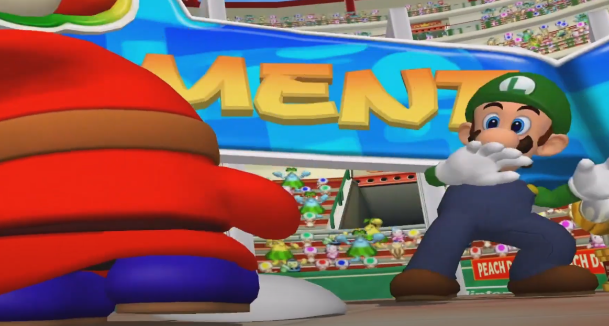
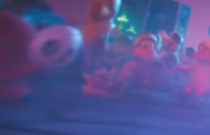

Hola, hoy os contaré mi teoría sobre lo que es Shy Guy.          
Este tema se hablaba sobre el 2017-2019, pero me parece interesante contarlo.   

Shy Guy apareció en la saga por primera vez en Super Mario USA (Super Mario Bros. 2, en occidente y América) como enemigo. Técnicamente no debería de ser del universo de Mario porque Mario USA es un *remake* de un juego japonés llamado ***Yume Kōjō: Doki Doki Panic!***. Como el juego original (SMB Lost levels) era muy complicado, cambiaron los personajes por Mario, Toad, Luigi y Peach y lo hicieron pasar por la secuela de Super Mario Bros. Por eso, tanto Birdo como Shy Guy entre otros son personajes "no oficiales" que se han convertido en oficiales.

Este último es uno de los más inquietantes de la saga, pués lleva una máscara y le ha ha quitado en muy escasas ocasiones. Lo malo es que nunca le enfocan. En la época de la GameCube, había un juego de tenis en el que Shy Guy al ganar se tropezaba y se le caía la máscara y luigi se asustó al verle la cara. Años después un *mod* que modificaba la cámara descubrió que no había nada en Shy Guy, que estaba hueco, pero no significa que esté vacío, lo que pasa es que los *devs* no tenían por qué modelarle el interior, ya que no se vería dentro del juego. Otras teorías contaban que eran Boos por la forma de sus brazos y su voz extraña, y llevaban máscaras para no asustarse si le miran, pero no es cierta porque los Boos tienen la voz aguda y atraviesan cosas, no podrían estarse en el disfraz. En resumen, todavía no sabe nadie qué o quién es, pero tiene que ser aterrador, eso sí porque como dije antes, Luigi se espantaba al ver el rostro del personaje y en la reciente película de Super Mario en la escena del concierto en el reino de Bowser, discretamente aparece de espaldas un Shy Guy quitándose la máscara delante de unos koopas y estos se asustan también

